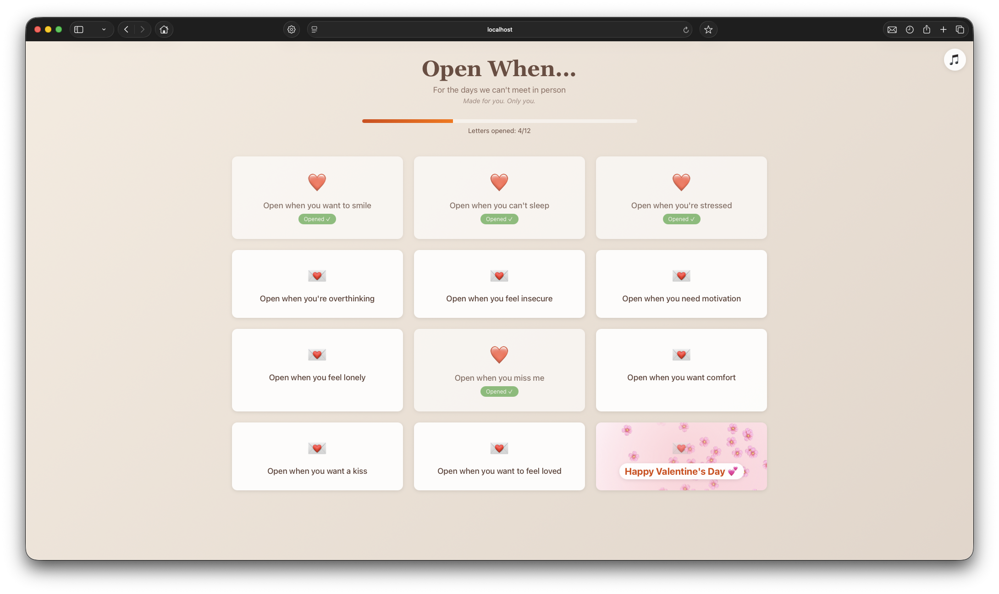

# Open When Letters 💌



A heartfelt "Open When" letters web app for your loved one. Create a personalized collection of letters that can be opened at different moments - when they miss you, need motivation, want to smile, or on special dates. Includes a special Valentine's Day letter that automatically unlocks at midnight on February 14th!

## Quick Start

New to this project? Start here:

1. **Install dependencies:**
   ```bash
   npm install
   ```

2. **Run the app:**
   ```bash
   npm start
   ```
   Open [http://localhost:3000](http://localhost:3000)

3. **Default login password:** `password` (you'll change this later)

## Customization

**Before deploying, you MUST customize:**
- Login password in `/src/App.jsx`
- Recipient's name in `/src/components/Login/Login.jsx`
- Your name in `/src/components/LetterView/LetterView.jsx`
- Letter content in `/src/data/letters.js`

For detailed customization instructions, see **[CUSTOMIZATION.md](CUSTOMIZATION.md)**

## Features

- 💌 **12 Unique Letters** - Different letters for different moments
- 🔒 **Password Protected** - Secure login to access the letters
- ⏰ **Valentine's Day Timer** - Special letter that automatically unlocks on February 14th at midnight
  
  <p align="center"></p>
  
- 📊 **Progress Tracking** - Remembers which letters have been opened
- 🎙️ **Voice Notes** - Optional audio messages for each letter
- 📸 **Photo Integration** - Add personal photos to each letter
- 🎵 **Background Music** - Optional music player
- 💝 **Beautiful Design** - Handwritten letter aesthetic with animations
- 📱 **Fully Responsive** - Works perfectly on mobile and desktop

## Deployment

1. **Build for production:**
   ```bash
   npm run build
   ```

2. **Deploy the `build` folder to:**
   - **[Netlify](https://netlify.com)** - Drag and drop deployment
   - **[Vercel](https://vercel.com)** - GitHub integration
   - **GitHub Pages** - See [CUSTOMIZATION.md](CUSTOMIZATION.md) for setup

## 🛠️ Technologies Used

- React 18
- CSS3 with custom animations
- LocalStorage for progress persistence

## 📚 Documentation

- **[CUSTOMIZATION.md](CUSTOMIZATION.md)** - Detailed customization guide

---

Made with ❤️ for someone special.
